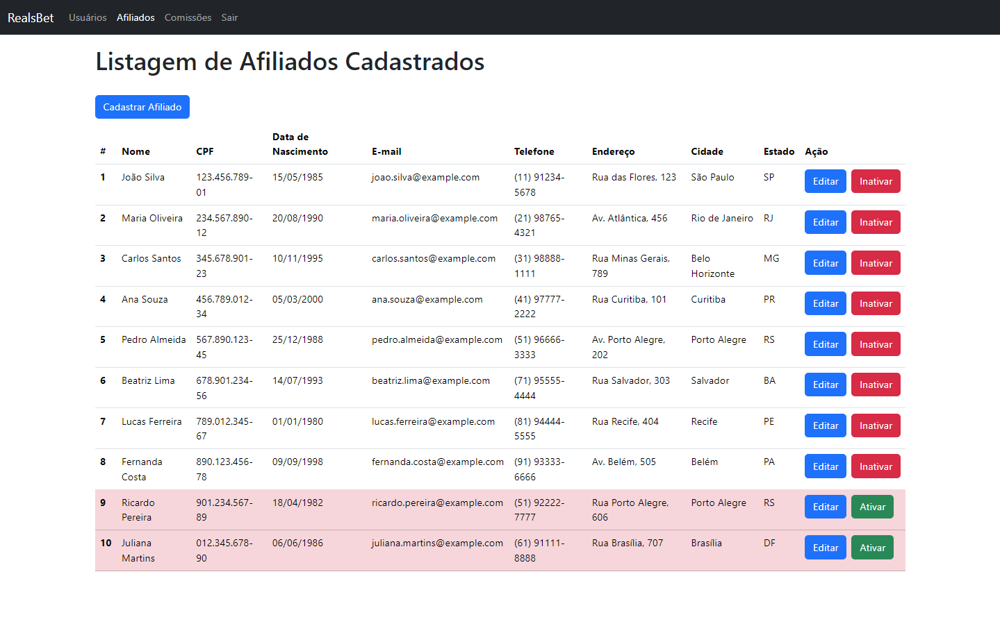

  

# RealsBet - PHP Laravel Pleno

# Requisitos

# Usuários
•	Deve existir uma tela para o Cadastro do Usuário
•	Deve existir uma tela para a listagem dos Usuários Cadastrados
•	Deve permitir a edição do Cadastro de Usuário
•	Deve permitir a inativar um Usuário Cadastrado

# Afiliados
•	Deve existir uma tela para o Cadastro do Afiliado
•	Deve existir uma tela para a listagem dos Afiliados Cadastrados
•	Deve permitir a edição do Cadastro de Afiliado
•	Deve permitir a inativar um Afiliado Cadastrado

# Comissão de Afiliado
•	Deve existir uma tela para o Adicionar uma comissão a um afiliado
•	Deve permitir excluir uma Comissão de Afiliado
•	Deve existir uma tela para Consulta de Comissão do Afiliado

# Cadastro de Usuários
•	E-mail
•	Senha
•	Nome

# Cadastro de Afiliados
•	Nome
•	CPF
•	Data Nascimento
•	Email
•	Telefone
•	Endereço
•	Cidade (Campo de Seleção)
•	Estado (Campo de Seleção)

# Comissão
•	Afiliado
•	Valor (Pode ser positivo ou negativo)
•	Data

# Observações
•	Ao selecionar o estado, deverá aparecer as cidades do estado selecionado.
•	O Valor da comissão informado pode ser tanto positivo como nagativo, mantendo o sinal)
•	Pode ser usado para o Front qualquer framework de CSS ao seu desejo (Bootstrap, Tailwindcss,Bulma, Material, etc..)

## Tech Stack

<!--- # "Verify icons availability here https://github.com/tandpfun/skill-icons" -->

## Getting Started

1. **Install Dependencies**: `npm install or yarn`
2. **Create containers**: `docker-compose up -d`
3. **Environment variables**: Copy `.env.example` to a new `.env.local`
4. **Database Setup**: `npx prisma migrate dev --name init`
5. **Start Developing**: `npm run start:dev (api) & npm run dev (frontend)`
